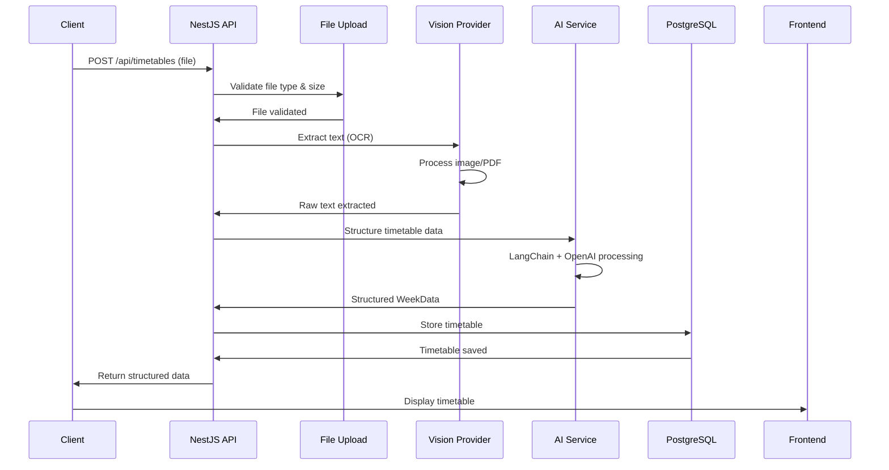
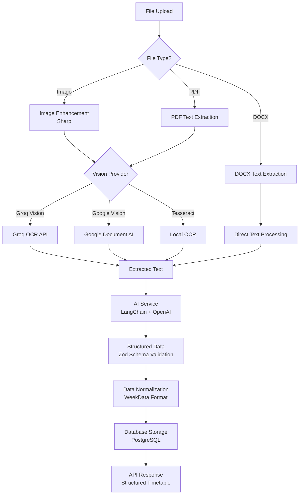
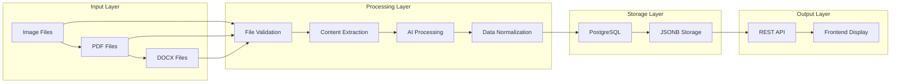

# Architectural Design Plan
## Timetable Extraction System

### Executive Summary

This document outlines the comprehensive architectural design for a Timetable Extraction System that processes uploaded documents (images, PDFs, DOCX) and extracts structured timetable data using AI-powered OCR and natural language processing. The system is built on a modern NestJS backend with PostgreSQL storage and supports multiple vision providers for optimal accuracy and cost-effectiveness.

---

## 1. System Architecture Overview

### 1.1 High-Level Architecture

The system follows a **3-layer architecture** with clear separation of concerns:

```
┌─────────────────────────────────────────────────────────────┐
│                    PRESENTATION LAYER                        │
│  ┌─────────────────┐  ┌─────────────────┐  ┌──────────────┐ │
│  │   Web Frontend   │  │  Mobile App     │  │  API Client  │ │
│  │   (React/Vue)   │  │  (React Native)│  │  (External)  │ │
│  └─────────────────┘  └─────────────────┘  └──────────────┘ │
└─────────────────────────────────────────────────────────────┘
                              │
                              ▼
┌─────────────────────────────────────────────────────────────┐
│                    APPLICATION LAYER                        │
│  ┌─────────────────┐  ┌─────────────────┐  ┌──────────────┐ │
│  │  REST API        │  │  File Upload    │  │  Processing  │ │
│  │  (NestJS)        │  │  (Multer)       │  │  Pipeline    │ │
│  └─────────────────┘  └─────────────────┘  └──────────────┘ │
│  ┌─────────────────┐  ┌─────────────────┐  ┌──────────────┐ │
│  │  AI Service     │  │  Vision OCR     │  │  Data        │ │
│  │  (LangChain)    │  │  (Multi-Provider)│  │  Normalization│ │
│  └─────────────────┘  └─────────────────┘  └──────────────┘ │
└─────────────────────────────────────────────────────────────┘
                              │
                              ▼
┌─────────────────────────────────────────────────────────────┐
│                      DATA LAYER                             │
│  ┌─────────────────┐  ┌─────────────────┐  ┌──────────────┐ │
│  │  PostgreSQL     │  │  File Storage   │  │  Cache        │ │
│  │  (Structured)   │  │  (Local/Cloud)  │  │  (Redis)      │ │
│  └─────────────────┘  └─────────────────┘  └──────────────┘ │
└─────────────────────────────────────────────────────────────┘
```

### 1.2 Core Components

1. **API Gateway**: NestJS-based REST API with Swagger documentation
2. **File Processing Engine**: Multi-provider OCR and document parsing
3. **AI Extraction Service**: LangChain + OpenAI for intelligent data structuring
4. **Data Storage**: PostgreSQL with JSONB for flexible timetable storage
5. **Vision Providers**: Groq Vision, Google Document AI, Tesseract fallback

---

## 2. End-to-End Workflow

### 2.1 Complete System Flow



### 2.2 Detailed Processing Pipeline



### 2.3 Data Flow Architecture



---

## 3. Technology Stack & Recommendations

### 3.1 Backend Framework & Language

**Primary Choice: NestJS (TypeScript)**
- **Rationale**: Enterprise-grade Node.js framework with built-in TypeScript support
- **Features**: Dependency injection, decorators, modular architecture
- **Benefits**: Scalable, maintainable, excellent documentation
- **Alternatives**: Express.js (simpler), Fastify (faster), Koa.js (modern)

### 3.2 Database & Storage

**Primary Database: PostgreSQL**
- **Rationale**: ACID compliance, JSONB support, excellent TypeScript integration
- **Schema**: Single table with JSONB for flexible timetable structure
- **ORM**: TypeORM for type-safe database operations
- **Alternatives**: MongoDB (NoSQL), MySQL (simpler), SQLite (development)

**File Storage Options:**
1. **Development**: Local filesystem (`./uploads/`)
2. **Production**: AWS S3, Google Cloud Storage, Azure Blob Storage
3. **Hybrid**: Local with cloud backup

### 3.3 OCR & Document Processing

#### 3.3.1 **HOSTED OCR SERVICES** (Recommended for Production)

**🏆 TOP CHOICE: AWS Textract**
- **Specialization**: **Table extraction specialist** with 99%+ accuracy for structured data
- **Features**: 
  - Native table detection and cell extraction
  - Form field recognition
  - Multi-page document processing
  - Confidence scores for each extracted element
- **Pricing**: $1.50 per 1,000 pages (first 1M pages)
- **Integration**: AWS SDK with Node.js/Python
- **Best For**: Production systems requiring high table accuracy

**🥈 ALTERNATIVE: Azure Form Recognizer**
- **Specialization**: Document understanding with table extraction
- **Features**:
  - Pre-built models for invoices, receipts, tables
  - Custom model training capabilities
  - Layout analysis with table structure preservation
- **Pricing**: $1.00 per 1,000 transactions
- **Integration**: Azure SDK with multiple language support
- **Best For**: Enterprise applications with custom document types

**🥉 BUDGET OPTION: Google Document AI**
- **Specialization**: General document processing with table support
- **Features**:
  - Table detection and extraction
  - Form parsing
  - Handwriting recognition
- **Pricing**: $0.50 per 1,000 pages
- **Integration**: Google Cloud SDK
- **Best For**: Cost-effective table extraction

#### 3.3.2 **PYTHON FRAMEWORKS** (For Advanced Table Processing)

**🐍 RECOMMENDED: PaddleOCR + TableNet**
```python
# Python service for advanced table extraction
import paddleocr
from tablenet import TableNet

class AdvancedTableExtractor:
    def __init__(self):
        self.ocr = paddleocr.PaddleOCR(use_angle_cls=True, lang='en')
        self.table_net = TableNet()
    
    def extract_tables(self, image_path):
        # Step 1: OCR text extraction
        ocr_result = self.ocr.ocr(image_path, cls=True)
        
        # Step 2: Table structure detection
        table_structure = self.table_net.detect_tables(image_path)
        
        # Step 3: Combine OCR + table structure
        return self.combine_results(ocr_result, table_structure)
```

**Benefits of Python Approach:**
- **Superior Table Recognition**: Specialized libraries for table detection
- **Custom Training**: Train models on specific timetable formats
- **Cost Control**: No per-request pricing, only compute costs
- **Flexibility**: Full control over processing pipeline

**🔧 PYTHON LIBRARIES FOR TABLE EXTRACTION:**

1. **TableNet** - Deep learning for table structure recognition
2. **PaddleOCR** - High-accuracy OCR with table support
3. **Camelot** - PDF table extraction specialist
4. **Tabula-py** - Table extraction from PDFs
5. **pdfplumber** - Advanced PDF parsing with table detection

#### 3.3.3 **HYBRID APPROACH** (Best of Both Worlds)

```typescript
// Node.js service calling Python OCR microservice
class HybridOCRService {
  async extractTables(file: Express.Multer.File): Promise<TableData> {
    try {
      // Primary: Python service for table extraction
      const pythonResult = await this.callPythonOCR(file.path);
      
      if (pythonResult.confidence > 0.9) {
        return pythonResult;
      }
      
      // Fallback: Hosted service
      const hostedResult = await this.callAWSTextract(file.path);
      return hostedResult;
      
    } catch (error) {
      // Final fallback: Current Groq/Google Vision
      return await this.fallbackOCR(file);
    }
  }
  
  private async callPythonOCR(filePath: string): Promise<TableData> {
    // Call Python microservice via HTTP/gRPC
    const response = await fetch('http://python-ocr-service:8000/extract-tables', {
      method: 'POST',
      body: formData
    });
    return response.json();
  }
}
```

#### 3.3.4 **IMPLEMENTATION RECOMMENDATIONS**

**For Immediate Implementation:**
1. **Keep current Groq/Google Vision** for general text extraction
2. **Add AWS Textract** for table-specific documents
3. **Implement fallback chain**: Textract → Groq → Google → Tesseract

**For Future Enhancement:**
1. **Deploy Python OCR microservice** using Docker
2. **Use specialized table extraction libraries**
3. **Implement custom model training** for timetable formats

**Cost-Benefit Analysis:**

| Solution | Setup Time | Monthly Cost (1K docs) | Table Accuracy | Maintenance |
|----------|------------|----------------------|----------------|-------------|
| **AWS Textract** | 2 hours | $1.50 | 99% | Low |
| **Python Service** | 1-2 days | $0.50 (compute) | 95-98% | Medium |
| **Current Groq** | 0 hours | $0.10 | 85-90% | Low |

#### 3.3.5 **CURRENT IMPLEMENTATION** (Keep as Fallback)

**Primary OCR: Groq Vision AI**
- **Model**: Llama 3.2 Vision (11B parameters)
- **Benefits**: Fast (2-5s), cost-effective, free tier available
- **Accuracy**: 95-99% for clean documents
- **Setup**: 2-minute configuration

**Secondary OCR: Google Document AI**
- **Benefits**: Enterprise-grade, highest accuracy (98-99%)
- **Features**: Multi-page PDF support, handwriting recognition
- **Cost**: Pay-per-page model
- **Setup**: 15-30 minutes configuration

**Fallback OCR: Tesseract.js**
- **Benefits**: Local processing, no API calls
- **Accuracy**: 85-95% depending on image quality
- **Use Case**: Offline processing, privacy requirements

### 3.4 AI & Language Processing

**Primary AI: OpenAI GPT-4o-mini**
- **Framework**: LangChain for structured prompting
- **Validation**: Zod schema for type-safe data extraction
- **Benefits**: Cost-effective, high accuracy, structured output
- **Alternatives**: Claude (Anthropic), Gemini (Google), local models

**Prompt Strategy:**
- **Template-based**: Consistent extraction format
- **Few-shot learning**: Examples for better accuracy
- **Schema validation**: Zod for type safety
- **Error handling**: Graceful fallbacks

### 3.5 Image Processing

**Primary Tool: Sharp**
- **Benefits**: High-performance image processing
- **Features**: Format conversion, resizing, enhancement
- **Use Cases**: Image optimization before OCR
- **Alternatives**: Jimp (lighter), ImageMagick (more features)

### 3.6 Frontend Technologies

**Recommended Stack:**
1. **React + TypeScript**: Component-based UI
2. **Material-UI/Ant Design**: Professional components
3. **React Query**: Data fetching and caching
4. **React Hook Form**: Form handling
5. **Chart.js/D3.js**: Timetable visualization

**Alternative Stacks:**
- **Vue.js**: Simpler learning curve
- **Angular**: Enterprise-grade, full framework
- **Svelte**: Lightweight, fast performance

---

## 4. Database Schema Design

### 4.1 Primary Table: `timetables`

```sql
CREATE TABLE timetables (
  id SERIAL PRIMARY KEY,
  filename VARCHAR(255) NOT NULL,
  upload_date TIMESTAMP DEFAULT NOW(),
  title VARCHAR(255),
  week_data JSONB NOT NULL,
  metadata JSONB,
  status VARCHAR(50) DEFAULT 'completed',
  created_at TIMESTAMP DEFAULT NOW(),
  updated_at TIMESTAMP DEFAULT NOW()
);

-- Indexes for performance
CREATE INDEX idx_timetables_upload_date ON timetables(upload_date);
CREATE INDEX idx_timetables_status ON timetables(status);
CREATE INDEX idx_timetables_week_data ON timetables USING GIN(week_data);
```

### 4.2 JSONB Structure: `week_data`

```typescript
interface WeekData {
  days: {
    monday: TimeBlock[];
    tuesday: TimeBlock[];
    wednesday: TimeBlock[];
    thursday: TimeBlock[];
    friday: TimeBlock[];
    saturday?: TimeBlock[];
    sunday?: TimeBlock[];
  };
}

interface TimeBlock {
  startTime: string;        // "09:00" (HH:MM format)
  endTime: string;          // "10:00" (HH:MM format)
  subject: string;          // "Mathematics"
  location?: string;        // "Room 101"
  teacherName?: string;     // "John Doe"
  notes?: string;           // "Bring calculator"
  duration?: number;        // Duration in minutes
  type?: string;            // "lesson", "break", "assembly"
}
```

### 4.3 Metadata Structure

```typescript
interface TimetableMetadata {
  fileType: 'image' | 'pdf' | 'docx';
  fileSize: number;
  processingDate: string;
  visionProvider: 'groq' | 'google' | 'tesseract';
  extractedText?: string;    // First 500 characters
  confidence?: number;       // OCR confidence score
  processingTime: number;    // Processing duration in ms
  originalDimensions?: {
    width: number;
    height: number;
  };
  enhancementApplied?: boolean;
}
```

### 4.4 Future Schema Extensions

```sql
-- User management (future)
CREATE TABLE users (
  id SERIAL PRIMARY KEY,
  email VARCHAR(255) UNIQUE NOT NULL,
  name VARCHAR(255),
  created_at TIMESTAMP DEFAULT NOW()
);

-- Timetable sharing (future)
CREATE TABLE timetable_shares (
  id SERIAL PRIMARY KEY,
  timetable_id INTEGER REFERENCES timetables(id),
  user_id INTEGER REFERENCES users(id),
  permission VARCHAR(20) DEFAULT 'read',
  created_at TIMESTAMP DEFAULT NOW()
);

-- Processing logs (future)
CREATE TABLE processing_logs (
  id SERIAL PRIMARY KEY,
  timetable_id INTEGER REFERENCES timetables(id),
  step VARCHAR(50),
  status VARCHAR(20),
  message TEXT,
  duration_ms INTEGER,
  created_at TIMESTAMP DEFAULT NOW()
);
```

---

## 5. LLM Integration Strategy

### 5.1 Pipeline Integration Points

The LLM is integrated at **two critical points** in the processing pipeline:

1. **Content Understanding**: After OCR extraction, the LLM analyzes raw text to understand timetable structure
2. **Data Structuring**: The LLM converts unstructured text into standardized JSON format

### 5.2 Prompt Engineering Strategy

#### 5.2.1 Primary Prompt Template

```typescript
const TIMETABLE_EXTRACTION_PROMPT = `
You are an expert text-to-JSON extractor specialized in parsing educational timetables.

TASK: Extract structured timetable data from the provided text.

REQUIREMENTS:
- Extract all time blocks for each day of the week
- Format times as HH:MM (24-hour format)
- Identify subjects, locations, teacher names, and notes
- Group activities by day (Monday through Sunday)
- Include recurring activities (breaks, lunch, assembly)

OUTPUT FORMAT:
{
  "title": "Timetable title",
  "schedule": {
    "monday": [
      {
        "startTime": "09:00",
        "endTime": "10:00",
        "subject": "Mathematics",
        "location": "Room 101",
        "teacherName": "John Doe",
        "notes": "Bring calculator"
      }
    ],
    "tuesday": [...],
    ...
  }
}

INPUT TEXT:
{extractedText}

EXTRACTED DATA:`;
```

#### 5.2.2 Few-Shot Learning Examples

```typescript
const FEW_SHOT_EXAMPLES = [
  {
    input: "Monday 9:00-10:00 Math (Room 101, Mr. Smith)",
    output: {
      startTime: "09:00",
      endTime: "10:00",
      subject: "Math",
      location: "Room 101",
      teacherName: "Mr. Smith"
    }
  },
  {
    input: "Tuesday 10:15-10:30 Break",
    output: {
      startTime: "10:15",
      endTime: "10:30",
      subject: "Break",
      type: "break"
    }
  }
];
```

### 5.3 Accuracy & Reproducibility Measures

#### 5.3.1 Schema Validation

```typescript
const TimeBlockSchema = z.object({
  startTime: z.string().regex(/^([0-1]?[0-9]|2[0-3]):[0-5][0-9]$/),
  endTime: z.string().regex(/^([0-1]?[0-9]|2[0-3]):[0-5][0-9]$/),
  subject: z.string().min(1),
  location: z.string().optional(),
  teacherName: z.string().optional(),
  notes: z.string().optional(),
  type: z.enum(['lesson', 'break', 'assembly', 'lunch']).optional()
});
```

#### 5.3.2 Confidence Scoring

```typescript
interface ExtractionResult {
  data: WeekData;
  confidence: number;        // 0-1 score
  warnings: string[];        // Low confidence fields
  processingTime: number;    // Duration in ms
  model: string;            // LLM model used
  temperature: number;      // Generation temperature
}
```

#### 5.3.3 Reproducibility Measures

1. **Fixed Temperature**: `temperature: 0.1` for consistent outputs
2. **Schema Validation**: Zod ensures consistent data structure
3. **Prompt Versioning**: Track prompt changes for reproducibility
4. **Model Versioning**: Pin to specific OpenAI model versions
5. **Seed Values**: Use consistent random seeds when possible

### 5.4 Error Handling & Fallbacks

```typescript
async function extractWithFallback(text: string): Promise<WeekData> {
  try {
    // Primary extraction with GPT-4o-mini
    return await extractWithGPT4(text);
  } catch (error) {
    console.warn('GPT-4 extraction failed, trying fallback');
    
    try {
      // Fallback to simpler prompt
      return await extractWithSimplePrompt(text);
    } catch (fallbackError) {
      console.error('All extraction methods failed');
      
      // Return minimal structure
      return createMinimalTimetable(text);
    }
  }
}
```

---

## 6. Error Handling & Fallback Strategies

### 6.1 File Upload Errors

#### 6.1.1 Invalid File Types
```typescript
// Validation middleware
const allowedMimeTypes = [
  'image/jpeg',
  'image/png', 
  'application/pdf',
  'application/vnd.openxmlformats-officedocument.wordprocessingml.document'
];

if (!allowedMimeTypes.includes(file.mimetype)) {
  throw new BadRequestException(
    `Unsupported file type: ${file.mimetype}. Allowed types: ${allowedMimeTypes.join(', ')}`
  );
}
```

#### 6.1.2 File Size Limits
```typescript
const MAX_FILE_SIZE = 10 * 1024 * 1024; // 10MB

if (file.size > MAX_FILE_SIZE) {
  throw new BadRequestException(
    `File too large: ${file.size} bytes. Maximum size: ${MAX_FILE_SIZE} bytes`
  );
}
```

### 6.2 OCR Processing Errors

#### 6.2.1 Vision Provider Fallback Chain
```typescript
async function extractTextWithFallback(file: Express.Multer.File): Promise<string> {
  const providers = ['groq', 'google', 'tesseract'];
  
  for (const provider of providers) {
    try {
      const extractor = this.extractorFactory.getExtractor(provider);
      if (await extractor.isConfigured()) {
        const text = await extractor.extract(file);
        if (text && text.trim().length > 0) {
          return text;
        }
      }
    } catch (error) {
      console.warn(`${provider} extraction failed:`, error.message);
      continue;
    }
  }
  
  throw new BadRequestException('All OCR providers failed. Please try a different file.');
}
```

#### 6.2.2 Image Enhancement Fallback
```typescript
async function enhanceImageWithFallback(buffer: Buffer): Promise<Buffer> {
  try {
    // Primary: Sharp enhancement
    return await sharp(buffer)
      .resize(2000, 2000, { fit: 'inside', withoutEnlargement: true })
      .sharpen()
      .normalize()
      .toBuffer();
  } catch (error) {
    console.warn('Sharp enhancement failed, using original');
    return buffer; // Return original if enhancement fails
  }
}
```

### 6.3 AI Processing Errors

#### 6.3.1 LLM Timeout Handling
```typescript
async function extractWithTimeout(prompt: string, timeoutMs: number = 30000): Promise<any> {
  const controller = new AbortController();
  const timeoutId = setTimeout(() => controller.abort(), timeoutMs);
  
  try {
    const response = await this.model.invoke(prompt, {
      signal: controller.signal
    });
    clearTimeout(timeoutId);
    return response;
  } catch (error) {
    clearTimeout(timeoutId);
    if (error.name === 'AbortError') {
      throw new Error('AI processing timeout. Please try again.');
    }
    throw error;
  }
}
```

#### 6.3.2 Schema Validation Fallback
```typescript
function validateWithFallback(data: any): WeekData {
  try {
    // Primary validation with strict schema
    return TimeBlockSchema.parse(data);
  } catch (error) {
    console.warn('Strict validation failed, using lenient validation');
    
    try {
      // Lenient validation
      return LenientTimeBlockSchema.parse(data);
    } catch (lenientError) {
      console.error('All validation failed, creating minimal structure');
      
      // Create minimal valid structure
      return createMinimalWeekData(data);
    }
  }
}
```

### 6.4 Database Errors

#### 6.4.1 Connection Pool Management
```typescript
// TypeORM configuration with retry logic
TypeOrmModule.forRoot({
  type: 'postgres',
  // ... other config
  retryAttempts: 3,
  retryDelay: 1000,
  maxQueryExecutionTime: 30000,
  logging: ['error', 'warn'],
  // Connection pool settings
  extra: {
    max: 20,
    min: 5,
    acquireTimeoutMillis: 30000,
    createTimeoutMillis: 30000,
    destroyTimeoutMillis: 5000,
    idleTimeoutMillis: 30000,
    reapIntervalMillis: 1000,
    createRetryIntervalMillis: 200,
  }
});
```

#### 6.4.2 Transaction Rollback
```typescript
async function saveTimetableWithRollback(timetableData: any): Promise<Timetable> {
  const queryRunner = this.dataSource.createQueryRunner();
  await queryRunner.connect();
  await queryRunner.startTransaction();
  
  try {
    const timetable = await queryRunner.manager.save(Timetable, timetableData);
    await queryRunner.commitTransaction();
    return timetable;
  } catch (error) {
    await queryRunner.rollbackTransaction();
    throw new Error(`Database save failed: ${error.message}`);
  } finally {
    await queryRunner.release();
  }
}
```

### 6.5 API Error Responses

#### 6.5.1 Standardized Error Format
```typescript
interface ApiError {
  statusCode: number;
  message: string;
  error: string;
  timestamp: string;
  path: string;
  details?: any;
}

// Example error responses
{
  "statusCode": 400,
  "message": "File processing failed: OCR extraction returned empty text",
  "error": "Bad Request",
  "timestamp": "2024-01-15T10:30:00.000Z",
  "path": "/api/timetables",
  "details": {
    "fileType": "image/jpeg",
    "fileSize": 2048576,
    "visionProvider": "groq",
    "processingTime": 2500
  }
}
```

---

## 7. System Flexibility & Future Extensibility

### 7.1 Modular Architecture Design

#### 7.1.1 Extractor Factory Pattern
```typescript
interface Extractor {
  extract(file: Express.Multer.File): Promise<string>;
  isConfigured(): Promise<boolean>;
  getProviderName(): string;
}

class ExtractorFactory {
  private extractors: Map<string, Extractor> = new Map();
  
  registerExtractor(name: string, extractor: Extractor): void {
    this.extractors.set(name, extractor);
  }
  
  getExtractor(name: string): Extractor {
    const extractor = this.extractors.get(name);
    if (!extractor) {
      throw new Error(`Extractor '${name}' not found`);
    }
    return extractor;
  }
}
```

#### 7.1.2 Plugin Architecture
```typescript
interface ProcessingPlugin {
  name: string;
  version: string;
  process(data: any): Promise<any>;
  isCompatible(version: string): boolean;
}

class PluginManager {
  private plugins: Map<string, ProcessingPlugin> = new Map();
  
  registerPlugin(plugin: ProcessingPlugin): void {
    this.plugins.set(plugin.name, plugin);
  }
  
  getPlugin(name: string): ProcessingPlugin {
    return this.plugins.get(name);
  }
}
```

### 7.2 Configuration Management

#### 7.2.1 Environment-Based Configuration
```typescript
interface AppConfig {
  database: DatabaseConfig;
  vision: VisionConfig;
  ai: AIConfig;
  storage: StorageConfig;
}

interface VisionConfig {
  primaryProvider: 'groq' | 'google' | 'tesseract';
  fallbackProviders: string[];
  timeout: number;
  retryAttempts: number;
}

// Configuration loading
const config: AppConfig = {
  database: {
    host: process.env.DB_HOST || 'localhost',
    port: parseInt(process.env.DB_PORT) || 5432,
    // ... other config
  },
  vision: {
    primaryProvider: process.env.VISION_PROVIDER as any || 'groq',
    fallbackProviders: ['google', 'tesseract'],
    timeout: parseInt(process.env.VISION_TIMEOUT) || 30000,
    retryAttempts: parseInt(process.env.VISION_RETRIES) || 3
  }
  // ... other configs
};
```

### 7.3 API Versioning Strategy

#### 7.3.1 URL-Based Versioning
```typescript
// API versioning
@Controller('api/v1/timetables')
export class TimetablesV1Controller {
  // Version 1 endpoints
}

@Controller('api/v2/timetables')
export class TimetablesV2Controller {
  // Version 2 endpoints with enhanced features
}
```

#### 7.3.2 Backward Compatibility
```typescript
// Response transformation for backward compatibility
class ResponseTransformer {
  transformV1ToV2(v1Response: any): any {
    return {
      ...v1Response,
      version: '2.0',
      enhanced: {
        confidence: v1Response.metadata?.confidence || 0.8,
        processingTime: v1Response.metadata?.processingTime || 0
      }
    };
  }
}
```

### 7.4 Database Migration Strategy

#### 7.4.1 Schema Evolution
```typescript
// Migration example
export class AddUserManagement1234567890 implements MigrationInterface {
  name = 'AddUserManagement1234567890';

  public async up(queryRunner: QueryRunner): Promise<void> {
    await queryRunner.createTable(
      new Table({
        name: 'users',
        columns: [
          {
            name: 'id',
            type: 'int',
            isPrimary: true,
            isGenerated: true,
            generationStrategy: 'increment'
          },
          {
            name: 'email',
            type: 'varchar',
            length: '255',
            isUnique: true
          }
        ]
      })
    );
  }

  public async down(queryRunner: QueryRunner): Promise<void> {
    await queryRunner.dropTable('users');
  }
}
```

### 7.5 Feature Flags System

#### 7.5.1 Runtime Feature Toggles
```typescript
interface FeatureFlags {
  enableAdvancedOCR: boolean;
  enableUserManagement: boolean;
  enableRealTimeProcessing: boolean;
  enableCloudStorage: boolean;
}

class FeatureFlagService {
  private flags: FeatureFlags;
  
  constructor() {
    this.flags = {
      enableAdvancedOCR: process.env.FEATURE_ADVANCED_OCR === 'true',
      enableUserManagement: process.env.FEATURE_USER_MANAGEMENT === 'true',
      enableRealTimeProcessing: process.env.FEATURE_REALTIME === 'true',
      enableCloudStorage: process.env.FEATURE_CLOUD_STORAGE === 'true'
    };
  }
  
  isEnabled(flag: keyof FeatureFlags): boolean {
    return this.flags[flag];
  }
}
```

### 7.6 Horizontal Scaling Preparation

#### 7.6.1 Stateless Design
```typescript
// Stateless service design
@Injectable()
export class ProcessingService {
  // No instance variables that maintain state
  // All data passed as parameters
  async processFile(file: Express.Multer.File, config: ProcessingConfig): Promise<Result> {
    // Processing logic
  }
}
```

#### 7.6.2 Queue-Based Processing
```typescript
// Future: Async processing with queues
interface ProcessingJob {
  id: string;
  filePath: string;
  userId: string;
  priority: number;
  createdAt: Date;
}

class ProcessingQueue {
  async addJob(job: ProcessingJob): Promise<void> {
    // Add to Redis queue
  }
  
  async processJobs(): Promise<void> {
    // Process jobs from queue
  }
}
```

### 7.7 Monitoring & Observability

#### 7.7.1 Health Check Endpoints
```typescript
@Controller('health')
export class HealthController {
  @Get()
  async checkHealth(): Promise<HealthStatus> {
    return {
      status: 'ok',
      timestamp: new Date().toISOString(),
      services: {
        database: await this.checkDatabase(),
        vision: await this.checkVisionProviders(),
        ai: await this.checkAIService()
      }
    };
  }
}
```

#### 7.7.2 Metrics Collection
```typescript
interface ProcessingMetrics {
  totalProcessed: number;
  successRate: number;
  averageProcessingTime: number;
  errorRate: number;
  visionProviderUsage: Record<string, number>;
}

class MetricsService {
  private metrics: ProcessingMetrics;
  
  recordProcessing(duration: number, success: boolean, provider: string): void {
    // Record metrics
  }
  
  getMetrics(): ProcessingMetrics {
    return this.metrics;
  }
}
```

### 7.8 Future Enhancement Roadmap

#### 7.8.1 Phase 1: Core Features (Current)
- ✅ File upload and validation
- ✅ Multi-provider OCR
- ✅ AI-powered extraction
- ✅ REST API
- ✅ PostgreSQL storage

#### 7.8.2 Phase 2: Enhanced Processing
- 🔄 **PRIORITY**: Integrate AWS Textract or Python OCR service for superior table parsing accuracy
- 🔄 Async processing with job queues
- 🔄 Real-time processing status
- 🔄 Batch file processing
- 🔄 Advanced image preprocessing
- 🔄 Deploy Python OCR microservice with TableNet/PaddleOCR

#### 7.8.3 Phase 3: User Management
- 📋 User authentication (JWT)
- 📋 Role-based access control
- 📋 Timetable sharing
- 📋 User preferences

#### 7.8.4 Phase 4: Advanced Features
- 📋 Multi-language support
- 📋 Export functionality (PDF, Excel)
- 📋 Timetable templates
- 📋 Integration APIs

#### 7.8.5 Phase 5: Enterprise Features
- 📋 Multi-tenant architecture
- 📋 Advanced analytics
- 📋 Custom field support
- 📋 Workflow automation

---

## 8. Security Considerations

### 8.1 File Upload Security
- File type validation (whitelist approach)
- File size limits
- Virus scanning (future enhancement)
- Secure file storage

### 8.2 API Security
- Rate limiting
- Input validation
- CORS configuration
- Authentication (future)

### 8.3 Data Protection
- Environment variable security
- Database encryption
- API key rotation
- Audit logging

---

## 9. Performance Optimization

### 9.1 Caching Strategy
- Redis for API response caching
- Database query optimization
- Image processing caching
- CDN for static assets

### 9.2 Database Optimization
- Proper indexing
- Connection pooling
- Query optimization
- JSONB query performance

### 9.3 Processing Optimization
- Parallel processing
- Image compression
- Lazy loading
- Background processing

---

## 10. Deployment Architecture

### 10.1 Development Environment
- Local PostgreSQL
- Local file storage
- Environment variables
- Hot reloading

### 10.2 Production Environment
- Containerized deployment (Docker)
- Cloud database (AWS RDS, Google Cloud SQL)
- Cloud storage (S3, GCS)
- Load balancing
- Auto-scaling

### 10.3 CI/CD Pipeline
- Automated testing
- Code quality checks
- Security scanning
- Automated deployment

---

## Conclusion

This architectural design provides a robust, scalable, and maintainable foundation for the Timetable Extraction System. The modular architecture ensures flexibility for future enhancements while maintaining high performance and reliability. The comprehensive error handling and fallback strategies ensure system resilience, while the extensibility design allows for easy integration of new features and technologies.

The system is designed to handle current requirements while being prepared for future growth and feature additions, making it a solid foundation for a production-ready timetable extraction platform.
